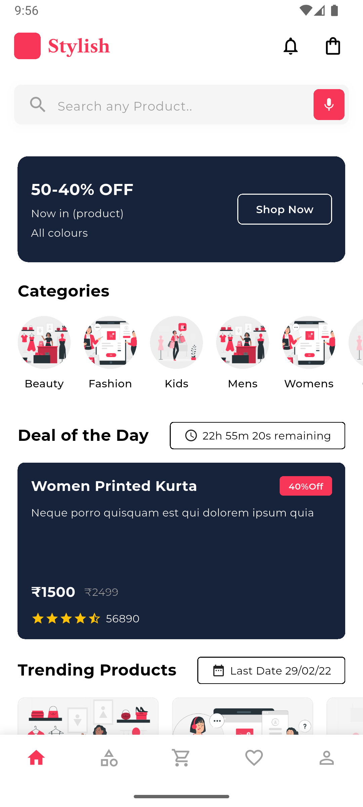
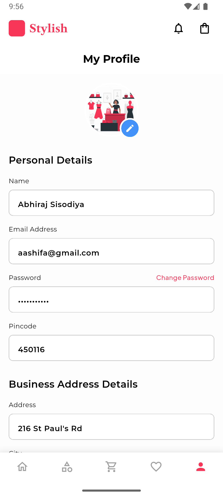

# Stylish - E-Commerce Flutter App

A modern and stylish e-commerce mobile application built with Flutter, featuring a clean UI design with a pink and black color scheme.

## Features

- **User Authentication**: Sign up, sign in, and password recovery
- **Product Browsing**: Browse through various categories including Fashion, Beauty, Kids, Mens, and Womens
- **Shopping Cart**: Add items to cart with quantity management
- **Wishlist**: Save favorite items for later
- **User Profile**: Manage personal and business address details
- **Secure Checkout**: Complete payment process with card details
- **Onboarding Flow**: Interactive onboarding screens for new users

## Screenshots

### Splash Screen


The app launches with a clean splash screen featuring the Stylish logo.

### Onboarding Screens


**Choose Products** - First onboarding screen introducing product selection


**Make Payment** - Second onboarding screen showcasing the payment process


**Get Your Order** - Third onboarding screen highlighting order delivery


**Get Started** - Welcome screen with call-to-action to begin shopping

### Authentication Screens


**Sign In** - Welcome back screen with email/password login and social media options


**Forgot Password** - Password recovery screen with email verification


**Sign Up** - Create new account with full name, email, and password fields

### Main App Screens



**Home Screen** - Main dashboard featuring:
- Search functionality with voice input
- Categories section (Beauty, Fashion, Kids, Mens, Womens)
- Deal of the Day with countdown timer
- Trending Products section
- Bottom navigation bar


**Products List** - Browse products with:
- Total item count (52,082+ items)
- Sort and filter options
- Product cards with images, names, descriptions, prices, and ratings
- Grid layout view

### Shopping Features


**Shopping Cart** - View and manage cart items:
- Product details with images and descriptions
- Quantity adjustment controls
- Price breakdown (Subtotal, Discount, Shipping)
- Total amount calculation
- Checkout button


**Wishlist** - Save favorite items:
- Nike Sneakers collection
- Product ratings and reviews
- Quick add to cart option
- Remove from wishlist functionality

### User Account



**Profile Screen** - Manage account details:
- Personal information (Name, Email, Password)
- Pincode settings
- Business address details
- Profile picture upload option

### Checkout Process


**Checkout - Payment Details** - Secure payment screen:
- Card number input
- Expiry date and CVV fields
- Name on card
- Order summary with item details
- Price breakdown
- Place Order button


**Payment Success** - Order confirmation:
- Success checkmark
- Order amount details
- Payment confirmation message
- Continue shopping option

## Technical Details

- **Framework**: Flutter
- **Platform**: Cross-platform (iOS & Android)
- **UI/UX**: Material Design with custom styling
- **Color Scheme**: Pink (#FF4B5C) and Black theme
- **Typography**: Clean and modern font styling

## Getting Started

1. Clone the repository
```bash
git clone https://github.com/yourusername/my_flutter_app.git
```

2. Install dependencies
```bash
flutter pub get
```

3. Run the app
```bash
flutter run
```

## Requirements

- Flutter SDK: 3.0.0 or higher
- Dart SDK: 2.17.0 or higher
- Android Studio / Xcode for platform-specific builds

## License

This project is licensed under the MIT License - see the LICENSE file for details.

## Author

Developed with ❤️ by Jayesh Kushwaha